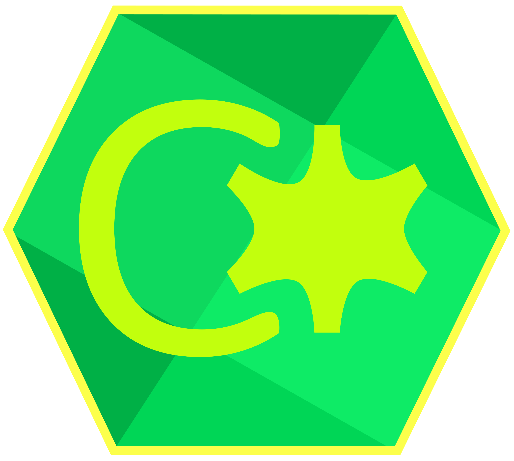

<p align="center">
  
</p>

<h1 align="center">C X _ C O M P I L E R</h1>

<p align="center">
  [ <strong>Un langage bas niveau à syntaxe moderne</strong> ]<br>
  <em>Peu de concepts, tout est possible.</em>
</p>

<p align="center">
  <a href="#-philosophie">Philosophie</a> |
  <a href="#-installation">Installation</a> |
  <a href="#-utilisation">Utilisation</a> |
  <a href="#-documentation">Documentation</a>
</p>

---

### / PHILOSOPHIE

Cx est un langage de programmation compilé, conçu pour offrir un contrôle total sur la machine tout en conservant une syntaxe moderne, claire et minimale. L'objectif est double : réduire la complexité cognitive tout en garantissant des performances optimales.

La règle d'or : *aucune magie cachée*. Le cœur du langage ne contient que l'essentiel :

*   **Variables** : `set` et `const`
*   **Types de base** : primitifs (`int`, `uint`, `flt`, `str`, etc.) et agrégats (`obj`, `arr`, `enum`)
*   **Contrôle** : `if`, `for`, `match`
*   **Comportement** : `func`, `self`
*   **Mémoire** : gestion explicite (`alloc`, `free`, pointeurs, `@unsafe`)

Tout le reste (vecteurs, dictionnaires, algorithmes avancés) est délégué à la bibliothèque standard.

---

### / ARCHITECTURE DU COMPILATEUR

Le compilateur actuel est implémenté en Python et génère un code natif hautement optimisé via LLVM.

*   `Lexer & Parser` : Analyse lexicale optimisée et parsing AST strict basé sur Lark.
*   `Génération de code` : Transformation de l'AST en représentation intermédiaire (IR), puis en binaire natif grâce à LLVMLite.
*   `Mémoire` : Compilation native directe, sans machine virtuelle ni garbage collector imposé.

---

### / INSTALLATION (DEVELOPPEMENT)

Pour les contributeurs et utilisateurs souhaitant tester le compilateur en local :

```bash
# 1. Cloner le dépôt racine
git clone https://github.com/still-eau/Cx.git
cd Cx

# 2. Installer le compilateur en mode développement
pip install -e ".[dev]"
```

*Dépendances majeures :*
*   `llvmlite` : Génération de code système via LLVM
*   `lark` : Parsing et construction de l'arbre syntaxique
*   `typer` & `rich` : Interface système en ligne de commande (CLI) élégante

---

### / UTILISATION

L'interface de commande `cx` permet d'invoquer le binaire du compilateur :

```bash
# Compiler un code source vers un exécutable natif
cx build nom_du_fichier.cx

# Afficher les commandes et options disponibles
cx --help
```

Exemple d'un programme simple minimal (`01_hello.cx`) :
```rust
@import:std/io/print();

func main() -> int {
    print("Hello, System!\n");
    return 0;
}
```

---

### / DOCUMENTATION DE REFERENCE

Tous les aspects syntaxiques et concepts approfondis du langage sont documentés dans le dossier `/Docs` :

*   [>> Variables & Constantes](Docs/syntax/variables.md)
*   [>> Types de données](Docs/syntax/types.md)
*   [>> Fonctions & Erreurs](Docs/syntax/functions.md)
*   [>> Flux de contrôle](Docs/syntax/control_flow.md)
*   [>> Modificateurs & Attributs](Docs/syntax/attributes.md)
*   [>> Gestion Memoire & Pointers](Docs/syntax/memory.md)
*   [>> Système de Modules](Docs/syntax/modules.md)

---
<p align="center">
  -- Cx Compiler Project / 2026 --
</p>

PS: Toute contribution est la bienvenue !